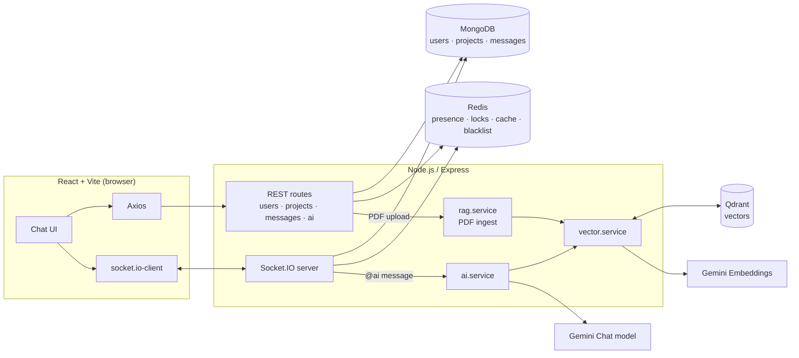
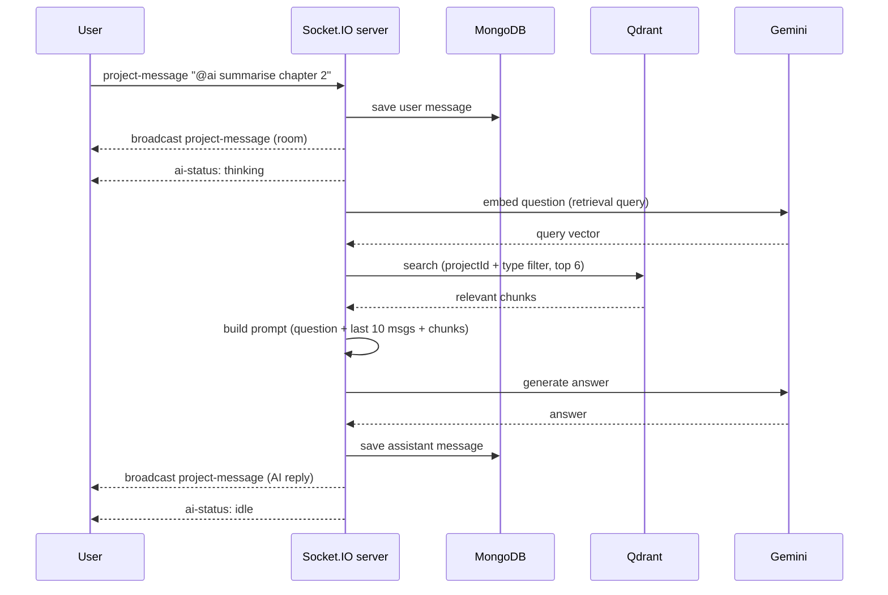

# TalkSpace 💬🤖

**Real-time collaborative chat with a shared AI assistant and PDF-powered RAG.**

Create a project, invite teammates, and chat live over WebSockets. Upload a PDF to the project and mention `@ai` in the chat: the assistant answers using the document (retrieval-augmented generation) plus the recent conversation.

| | Link |
|---|---|
| Frontend | https://my-app-frontend-gpo8.onrender.com |
| Backend | https://my-app-backend-utvv.onrender.com |

> Hosted on Render. If the service has been idle, the first request can take ~30–60s (cold start).

---

## Table of contents

1. [Features](#features)
2. [Tech stack](#tech-stack)
3. [Architecture](#architecture)
4. [How it works](#how-it-works)
   - [Auth](#1-authentication)
   - [Real-time chat](#2-real-time-chat-socketio)
   - [Presence](#3-online-presence)
   - [PDF upload and the shared lock](#4-pdf-upload-and-the-shared-lock)
   - [RAG pipeline](#5-rag-pipeline)
   - [Message caching](#6-message-caching)
5. [Project structure](#project-structure)
6. [API reference](#api-reference)
7. [Socket.IO events](#socketio-events)
8. [Environment variables](#environment-variables)
9. [Local setup](#local-setup)
10. [Deployment](#deployment)
11. [Known limitations / roadmap](#known-limitations--roadmap)

---

## Features

- 🔐 **JWT auth** – register / login / logout with token blacklisting in Redis
- 📁 **Projects (workspaces)** – create a project, add collaborators, each project is a private chat room
- ⚡ **Real-time chat** – Socket.IO rooms per project, messages persisted in MongoDB
- 🟢 **Live presence** – see who is online, multi-tab/multi-device aware, heartbeat based
- 🤖 **Shared AI assistant** – type `@ai <question>` and everyone in the room sees the answer
- 📄 **PDF knowledge base** – upload a PDF, it is parsed, chunked, embedded and stored in Qdrant
- 🔒 **Collaborative upload lock** – only one person can upload/remove the PDF at a time; everyone sees live status
- 🧠 **Conversation-aware answers** – the AI gets the last 10 chat messages + top retrieved document chunks
- 🚀 **Redis message cache** – fast history loading, MongoDB stays the source of truth

---

## Tech stack

**Frontend**
- React 19, Vite, React Router 7
- Tailwind CSS 4 (neo-brutalist UI)
- Axios (REST), `socket.io-client` (WebSocket)
- `react-hot-toast` for notifications

**Backend**
- Node.js (ES modules), Express 5
- Socket.IO 4 (real-time layer)
- MongoDB + Mongoose 9 (users, projects, messages)
- Redis via `ioredis` (token blacklist, presence, message cache, document locks)
- Multer (in-memory PDF upload, 10 MB limit, PDF only)
- express-validator, bcrypt, jsonwebtoken, cookie-parser, cors, morgan

**AI / RAG**
- **Gemini** (`@google/genai`) – chat model (default `gemini-3.1-flash-lite`) and embeddings (`gemini-embedding-2`, 3072 dims by default)
- **Qdrant** – vector database (cosine similarity, payload-filtered per project)
- PDF ingestion tooling: `pdf-parse`, `pdf-to-img`, LangChain (`langchain`, `@langchain/textsplitters`, `@langchain/core`, …), LlamaIndex

---

## Architecture



### The `@ai` message flow



---

## How it works

### 1. Authentication

- `POST /users/register` and `/users/login` return `{ user, token }`.
- The JWT payload is `{ email }`, expires in **24h**.
- The frontend stores the token in `localStorage` and attaches it to every request through an Axios interceptor (`Authorization: Bearer <token>`).
- `authUser` middleware: reads token (cookie or header) → checks the **Redis blacklist** → verifies JWT → loads the user from MongoDB → sets `req.user`.
- **Logout** writes the token into Redis with a 24h TTL so it can no longer be used.
- Sockets authenticate in `io.use(...)` with `socket.handshake.auth.token`, verified the same way.
- Frontend route guard (`UserAuth`) redirects to `/login` if no token exists.

### 2. Real-time chat (Socket.IO)

1. Client connects with the JWT in `auth.token`.
2. Client emits `join-project(projectId)`. The server checks the user is a member of that project, then joins the room `project:<projectId>`.
3. Client emits `project-message({ projectId, message })`.
4. Server validates membership, saves the message to MongoDB, and broadcasts `project-message` to the whole room.
5. If the text contains `@ai` (regex `/@ai\b/i`), the AI pipeline runs (see [RAG pipeline](#5-rag-pipeline)) and the reply is saved and broadcast as a message with `role: 'assistant'`.

Every event re-checks that the socket has joined the project and that the user belongs to it, so a user cannot post into someone else's room.

### 3. Online presence

Stored in a Redis **sorted set** per project: `project:<id>:presence`.

- Member = `userId:socketId`, score = expiry timestamp.
- Default TTL = **45s** (`REDIS_PRESENCE_TTL`); the client sends `presence-heartbeat` periodically (~every 15s) to refresh it.
- Expired members are pruned on every read (`ZREMRANGEBYSCORE`).
- Because members are per **socket**, a user with two tabs stays online until *both* disconnect.
- `online-users` is broadcast to the room on join / leave / heartbeat / disconnect.

### 4. PDF upload and the shared lock

Each project has **one active PDF** (`project.ragDocument`). Because multiple people share a project, uploads and removals are coordinated with a Redis lock so two people can't corrupt the index at once.

**Upload flow**

1. Client emits `project-document-upload-started` (with an ack callback).
2. Server acquires `project:document:lock:<projectId>` using `SET NX EX 1800` and stores the operation state (`uploading` / `processing` / `removing`, file name, user, socket) in `project:document:operation:<projectId>`.
3. Server broadcasts `project-document-upload-started` so every collaborator sees *"X is uploading…"* and can't start another operation.
4. Client sends the file: `POST /ai/projects/:projectId/documents` (multipart field `file`).
5. Backend validates membership + type + size and calls `ingestPdf(...)` (parse → chunk → embed → store in Qdrant).
6. Client emits `project-document-updated` → server releases the lock and broadcasts `project-document-state` with the new document.
7. On failure the client emits `project-document-operation-failed` → lock released, error broadcast.

**Remove flow** – `project-document-remove` acquires the lock, deletes all the project's vectors from Qdrant, sets `ragDocument = null`, releases the lock and broadcasts `project-document-removed`.

**Safety nets** – the lock auto-expires after 30 minutes, and if the socket that owns the lock disconnects, the lock is released automatically.

### 5. RAG pipeline

**Ingestion** (`services/rag.service.js` → `vector.service.js`)

1. PDF arrives in memory (Multer memory storage – nothing written to disk).
2. Text is extracted and split into chunks (the vector payload supports page number, section title/level/index, chunk index, parent chunk id/content and content type, plus flags for figures/vision extraction).
3. Each chunk is embedded with Gemini (`gemini-embedding-2`) using the retrieval-document task prefix.
4. Points are upserted into Qdrant in batches of 50 with a payload like:

```json
{
  "projectId": "…",
  "type": "document",
  "content": "chunk text",
  "docId": "…",
  "fileName": "notes.pdf",
  "pageNumber": 3,
  "sectionTitle": "Introduction",
  "chunkIndex": 12,
  "parentId": "…",
  "createdAt": "2026-…"
}
```

Payload indexes (keyword) are created on `projectId`, `type`, `docId`, `fileName`, `contentType`, `parentId` for fast filtered search.

**Retrieval + generation** (`services/ai.service.js`)

1. Embed the user's question (retrieval-query task prefix).
2. Search Qdrant with a **hard filter on `projectId`** (+ `type: document`) so projects never see each other's documents. Top **6** chunks, capped at **24,000 characters** of context.
3. Fetch the last **10** messages of the project chat so pronouns and follow-ups make sense.
4. Build a prompt containing: the question, recent conversation, and the numbered sources (file, chunk, page, section).
5. Prompt rules make the model: answer directly, use documents as the primary source, never invent project facts, say so when documents lack the info, and fall back to general knowledge for unrelated questions.
6. Gemini generates the answer, which is saved and broadcast.

### 6. Message caching

- **MongoDB** is the source of truth (`ProjectMessage` collection).
- **Redis list** `project:<id>:messages` keeps the latest **200** messages (TTL 1h, configurable).
- `getProjectMessages` reads from Redis first; on a miss it loads from MongoDB and re-populates the cache.
- Cache failures never break chat – errors are logged and MongoDB is used.

---

## Project structure

```
.
├── backend/
│   ├── app.js                    # Express app, CORS, routes
│   ├── server.js                 # HTTP + Socket.IO server (entry point)
│   ├── config/redis.js           # ioredis client
│   ├── db/db.js                  # MongoDB connection
│   ├── controllers/              # user, project, message, ai (upload)
│   ├── middleware/
│   │   ├── auth.middleware.js    # JWT + Redis blacklist
│   │   └── multer.middleware.js  # PDF-only, 10 MB, memory storage
│   ├── models/                   # user, project, message
│   ├── routes/                   # user, project, message, ai
│   └── services/
│       ├── ai.service.js         # prompt building + Gemini answer
│       ├── vector.service.js     # embeddings + Qdrant (store/search/delete)
│       ├── rag.service.js        # PDF ingestion pipeline
│       ├── message.service.js    # Mongo + Redis message logic
│       ├── redis.service.js      # presence + message cache
│       ├── project.service.js
│       └── user.service.js
└── frontend/
    ├── index.html
    ├── vite.config.js
    └── src/
        ├── App.jsx, main.jsx, index.css
        ├── auth/UserAuth.jsx     # protected route wrapper
        ├── config/axios.js       # Axios instance + token interceptor
        ├── config/socket.js      # Socket.IO client helpers
        ├── context/user.context.jsx
        ├── routes/AppRoutes.jsx
        └── screens/              # Login, Register, Home, Project
```

---

## API reference

Base URL: backend URL. Protected routes need `Authorization: Bearer <token>`.

### Users – `/users`

| Method | Route | Auth | Description |
|---|---|---|---|
| POST | `/users/register` | – | Create account → `{ user, token }` |
| POST | `/users/login` | – | Login → `{ user, token }` (`USER_NOT_FOUND` / `INVALID_CREDENTIALS` codes) |
| GET | `/users/profile` | ✅ | Current user |
| GET | `/users/logout` | ✅ | Blacklist token |
| GET | `/users/all` | ✅ | All users except me (for adding collaborators) |

### Projects – `/projects`

| Method | Route | Auth | Description |
|---|---|---|---|
| POST | `/projects/create` | ✅ | Body `{ name }` |
| GET | `/projects/all` | ✅ | Projects I belong to |
| PUT | `/projects/add-user` | ✅ | Body `{ projectId, users: [userId] }` |
| GET | `/projects/get-project/:projectId` | ✅ | Project with populated users |
| PUT | `/projects/update-file-tree` | ✅ | Body `{ projectId, fileTree }` |

### Messages – `/messages`

| Method | Route | Auth | Description |
|---|---|---|---|
| GET | `/messages/:projectId` | ✅ | Chat history (members only, max 200) |

### AI / documents – `/ai`

| Method | Route | Auth | Description |
|---|---|---|---|
| POST | `/ai/projects/:projectId/documents` | ✅ | `multipart/form-data`, field `file` (PDF ≤ 10 MB). Parses + indexes it |

### Misc

| Method | Route | Description |
|---|---|---|
| GET | `/api/health` | Health check |
| GET | `/` | "Hello World!" |

---

## Socket.IO events

Connection: `io(API_URL, { auth: { token } })`

### Client → Server

| Event | Payload | Purpose |
|---|---|---|
| `join-project` | `projectId` | Join room (membership checked) |
| `leave-project` | `projectId` | Leave room |
| `project-message` | `{ projectId, message }` | Send a chat message (`@ai` triggers the AI) |
| `presence-heartbeat` | `projectId` | Keep presence alive |
| `request-project-members` | `projectId` | Ask for the member list |
| `project-members-updated` | `{ projectId }` | Tell everyone the member list changed |
| `request-project-document` | `projectId` | Ask for the current PDF + operation state |
| `project-document-upload-started` | `{ projectId, fileName, status }` + ack | Acquire the document lock |
| `project-document-updated` | `{ projectId }` | Upload finished → release lock |
| `project-document-operation-failed` | `{ projectId, message }` | Upload failed → release lock |
| `project-document-remove` | `{ projectId }` + ack | Remove the PDF and its vectors |

### Server → Client

| Event | Payload |
|---|---|
| `project-message` | Saved message (user or assistant) |
| `ai-status` | `{ status: 'thinking' \| 'idle' }` |
| `online-users` | Array of online user IDs |
| `project-members-updated` | `{ projectId, users }` |
| `project-document-state` | `{ projectId, document, operation }` |
| `project-document-upload-started` | `{ projectId, fileName, status, userId }` |
| `project-document-remove-started` | `{ projectId, fileName, status, userId }` |
| `project-document-removed` | `{ projectId, document: null, message }` |
| `project-document-operation-failed` | `{ projectId, message }` |
| `project-error` | `{ message }` |

---

## Environment variables

### Backend (`backend/.env`)

```env
# Server
PORT=3000
CLIENT_URL=http://localhost:5173        # allowed CORS / Socket.IO origin
FRONTEND_URL=http://localhost:5173      # fallback for Socket.IO origin

# Database
MONGODB_URI=mongodb://localhost:27017/talkspace

# Auth
JWT_SECRET=change_me

# Redis (use REDIS_URL OR host/port/password)
REDIS_URL=redis://127.0.0.1:6379
# REDIS_HOST=127.0.0.1
# REDIS_PORT=6379
# REDIS_PASSWORD=
REDIS_MESSAGE_CACHE_TTL=3600
REDIS_PRESENCE_TTL=45

# Gemini
GEMINI_API_KEY=your_key
GEMINI_MODEL=gemini-3.1-flash-lite
GEMINI_EMBEDDING_MODEL=gemini-embedding-2
GEMINI_EMBEDDING_DIMENSIONS=3072

# Qdrant
QDRANT_URL=http://localhost:6333
QDRANT_API_KEY=
QDRANT_COLLECTION=project_vectors
```

> ⚠️ `GEMINI_EMBEDDING_DIMENSIONS` must match the Qdrant collection's vector size. If you change the embedding model/dimension, use a new `QDRANT_COLLECTION` (or delete the old one).

### Frontend (`frontend/.env`)

```env
VITE_API_URL=http://localhost:3000
```

(`VITE_API_URL` is used by both Axios and Socket.IO. `VITE_API_BASE_URL` is used by the small `apiFetch` helper and defaults to `http://localhost:3000`.)

---

## Local setup

### Prerequisites

- Node.js 20+
- MongoDB (local or Atlas)
- Redis (local or hosted)
- Qdrant (Docker or Qdrant Cloud)
- A Gemini API key

### 1. Clone

```bash
git clone <your-repo-url>
cd <repo>
```

### 2. Start the infrastructure (optional, via Docker)

```bash
docker run -d --name redis  -p 6379:6379 redis
docker run -d --name qdrant -p 6333:6333 qdrant/qdrant
docker run -d --name mongo  -p 27017:27017 mongo
```

### 3. Backend

```bash
cd backend
npm install
cp .env.example .env     # or create .env from the section above
node server.js           # entry point is server.js (not app.js)
```

Tip: add scripts to `backend/package.json`:

```json
"scripts": {
  "start": "node server.js",
  "dev": "node --watch server.js"
}
```

The server pings Redis and initialises the Qdrant collection on boot – it will exit with a clear error if either is unreachable or `GEMINI_API_KEY` / `QDRANT_URL` are missing.

### 4. Frontend

```bash
cd frontend
npm install
npm run dev              # http://localhost:5173
```

### 5. Try it

1. Register two accounts (use two browsers / an incognito window).
2. Create a project and add the second user.
3. Chat – messages appear instantly for both.
4. Upload a PDF inside the project.
5. Send `@ai what is this document about?` and watch the shared answer appear.

---

## Deployment

Currently deployed on **Render** (backend as a Web Service, frontend as a Static Site).

- Backend: build `npm install`, start `node server.js`. Set all backend env vars, including `CLIENT_URL` = your frontend URL. Managed Redis + Qdrant Cloud + MongoDB Atlas work well.
- Frontend: build `npm run build`, publish `dist`. Set `VITE_API_URL` = backend URL. Add a rewrite rule `/* → /index.html` for React Router.
- Make sure the frontend origin is in the CORS allow-list (`allowedOrigins` in `app.js` and the Socket.IO `cors.origin` in `server.js`).

---

## Known limitations / roadmap

- One PDF per project (uploading is locked while another operation runs).
- Long-term project "memory" (`createProjectMemory`) is a stub for now.
- Embeddings are generated sequentially – batching would speed up large PDFs.
- JWT is stored in `localStorage`; consider httpOnly cookies for stronger XSS protection.
- No automated tests yet.
- Ideas: multiple documents per project, streaming AI responses, source citations shown in the UI, typing indicators, file/image messages.

---

## License

ISC
